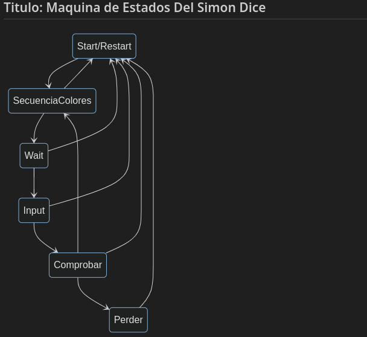
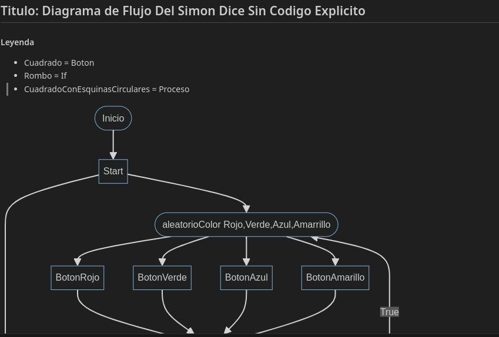
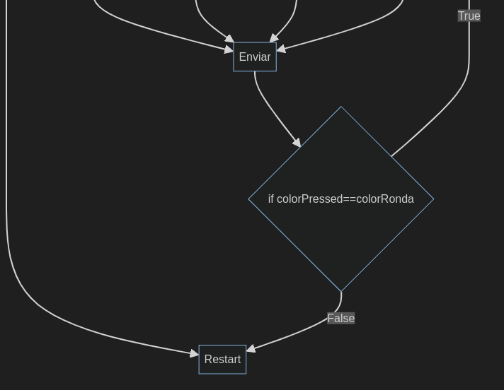

# Simon Dice

## Imagenes

## Clase DatosSingleton

Los datos que se necesitan para el funcionamiento del juego se guardan en esta clase.

#### Variables

- ronda Int que indica la ronda en la que estamos
- secuencia List<Int> que contiene la secuencia de colores que se van a mostrar
- secuenciaUsuario List<Int> que contiene la secuencia de colores que ha introducido el usuario
- record Int que indica el record del juego
- estado Enum que indica el estado del juego
- tag String que indica la etiqueta a usar para los logs
- colorAux Color que indica el color que se ha pulsado
- numeroDeColores Colores que indica el numero de colores que se van a usar en el juego
- listaColores List<Color> que contiene los colores que se van a usar en el juego

Luego una enum class que tiene los estados del juego.

Son: `INICIO`, `SECUENCIA`, `ENTRADA`, `COMPROBANDO`

Y luego otra enum class que tiene los colores que se van a usar en el juego.

Donde cada uno es un color mutable

